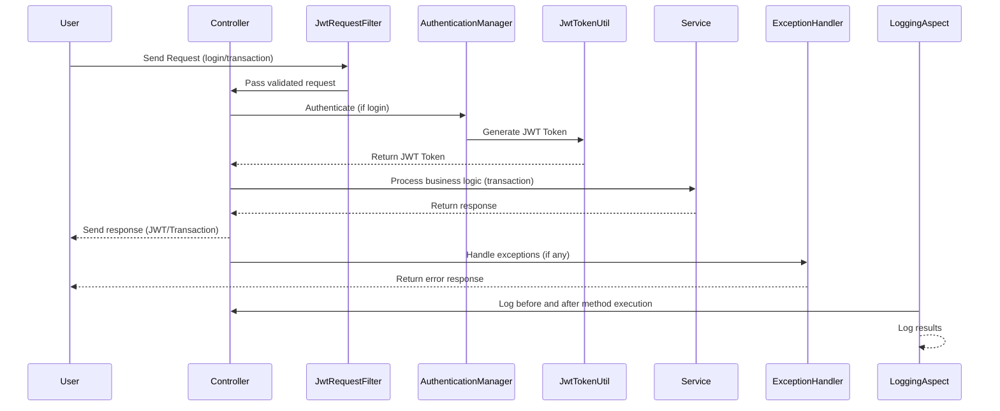

# Transaction BackEnd API

## Overview

This project is a Spring Boot application that provides RESTful APIs for managing transactions. It includes authentication using JWT tokens, role-based access control, and comprehensive error handling with custom exceptions.

## Prerequisites

- Java 17
- Maven
- MySQL Database

## Getting Started

### 1. Clone the Repository

```bash
git clone https://github.com/your-repo/transaction-backend.git
cd transaction-backend
```

### 2. Configure the Application
   Create an application.properties file in the src/main/resources directory with the following content:
   ```properties
spring.datasource.url=jdbc:mysql://localhost:3306/"your db"
spring.datasource.username=root
spring.datasource.password=
spring.jpa.hibernate.ddl-auto=update
spring.datasource.driver-class-name=com.mysql.cj.jdbc.Driver
spring.batch.initialize-schema=always
schema=always
```

### 3. Build and Run the Application
Use Maven to build and run the application:

```mvn
mvn clean install
mvn spring-boot:run
```

## Available APIs
### Authentication
1. Register a New User
   - Endpoint: /auth/register
   - Method: POST 
- Request Body
```json
{
    "username": "newuser",
    "password": "newpassword"
}
```
- Response:
```json
{
    "success": true,
    "message": "User registered successfully",
    "data": {
        "id": 1,
        "username": "newuser",
        "password": "$2a$10$...",
        "role": null
    }
}
```
2.  Login and Get JWT Token
    - Endpoint: /auth/login
    - Method: POST
- Request Body
```json
{
  "username": "newuser",
  "password": "newpassword"
}
```
- Response:
```json
{
  "token": "your_jwt_token"
}
```
## Transaction Management
1. Register a New User
    - Endpoint: /transactions
    - Method: GET
    - Headers:
      - Authorization: Bearer your_jwt_token
- Response:
```json
{
  "success": true,
  "message": "Transactions retrieved successfully",
  "data": {
    "transactions": [
      {
        "id": 1,
        "accountNumber": "123456789",
        "trxAmount": 1000.0,
        "description": "Deposit",
        "trxDate": "2023-08-01",
        "trxTime": "10:00:00",
        "customerId": "C001",
        "version": 1
      }
    ],
    "currentPage": 0,
    "totalItems": 1,
    "totalPages": 1
  }
}
```

2.  Get a Transaction by ID
    - Endpoint: /transactions/{id}
    - Method: GET
    - Headers:
        - Authorization: Bearer your_jwt_token
- Response:
```json
{
  "success": true,
  "message": "Transaction retrieved successfully",
  "data": {
    "id": 1,
    "accountNumber": "123456789",
    "trxAmount": 1000.0,
    "description": "Deposit",
    "trxDate": "2023-08-01",
    "trxTime": "10:00:00",
    "customerId": "C001",
    "version": 1
  }
}

```

3. Create a New Transaction
    - Endpoint: /transactions
    - Method: POST
    - Headers:
        - Authorization: Bearer your_jwt_token

- Request Body
```json
{
  "accountNumber": "123456789",
  "trxAmount": 1000.0,
  "description": "Deposit",
  "trxDate": "2023-08-01",
  "trxTime": "10:00:00",
  "customerId": "C001"
}

```
- Response:
```json
{
    "success": true,
    "message": "Transaction created successfully",
    "data": {
        "id": 2,
        "accountNumber": "123456789",
        "trxAmount": 1000.0,
        "description": "Deposit",
        "trxDate": "2023-08-01",
        "trxTime": "10:00:00",
        "customerId": "C001",
        "version": 1
    }
}

```

4. Update a Transaction
    - Endpoint: /transactions/{id}
    - Method: PUT
    - Headers:
        - Authorization: Bearer your_jwt_token

- Request Body
```json
{
  "description": "Updated description",
  "version": 1
}

```
- Response:
```json
{
  "success": true,
  "message": "Transaction updated successfully",
  "data": {
    "id": 1,
    "accountNumber": "123456789",
    "trxAmount": 1000.0,
    "description": "Updated description",
    "trxDate": "2023-08-01",
    "trxTime": "10:00:00",
    "customerId": "C001",
    "version": 2
  }
}
```

5. Delete a Transaction
    - Endpoint: /transactions/{id}
    - Method: DELETE
    - Headers:
        - Authorization: Bearer your_jwt_token
- Response:
```json
{
  "success": true,
  "message": "Transaction deleted successfully",
  "data": null
}
```

## Error Handling
The API uses a consistent response structure for both successful and error responses. Here's an example of the response structure:

- Success Response
```json
{
  "success": true,
  "message": "Operation successful",
  "data": { ... }
}
```
- Error Response:
```json
{
  "success": false,
  "message": "Error message",
  "data": null
}

```

## Logging and Error Handling
All exceptions are handled by the GlobalExceptionHandler class.
Detailed logging is provided using SLF4J, including logging for both successful operations and exceptions.

## Activity Diagram


## Design Patterns
### 1. Model-View-Controller (MVC) Pattern:

- The entire structure of the backend application is based on the MVC Pattern. 
    - Example:
      - Controller Layer: AuthController, TransactionController handle HTTP requests. 
      - Service Layer: JwtUserDetailsService, TransactionService handle business logic. 
      - Model Layer: User, Transaction represent the data structure. 
  
### 2. Singleton Pattern:
  - Spring beans like JwtTokenUtil, LoggingAspect, and AuthenticationManager are created as singletons by default, ensuring only one instance exists in the application context. 
    - Example:
      - JwtTokenUtil and LoggingAspect are typical examples of beans where a single instance is shared across the application.

### 3. Dependency Injection (DI) Pattern:
- The Dependency Injection Pattern is central to Spring, where dependencies are injected into components like controllers, services, and repositories.
  - Example:
    - @Autowired is used to inject beans like JwtUserDetailsService, AuthenticationManager, and JwtTokenUtil into controllers.
    
### 4. Proxy Pattern:
- The Proxy Pattern is applied in the way Spring AOP (Aspect-Oriented Programming) works. The LoggingAspect acts as a proxy, adding additional behavior (logging) to methods in the controller and service layers. 
  - Example:
    - The LoggingAspect intercepts method calls and logs before and after method execution without modifying the actual method logic.
    
### 5. Builder Pattern:
- The Builder Pattern is used in creating and configuring various components in the backend application. 
  - Example:
    - Configuring HTTP security in SecurityConfig using the HttpSecurity builder to define security rules and CORS configurations.
    
### 6. Template Method Pattern:
- Spring Security uses the Template Method Pattern where the core security flow is defined by the framework, and specific security configurations are provided in classes like SecurityConfig. 
  - Example:
    - The security setup involves overriding methods in SecurityConfig to provide custom authentication and authorization rules.
